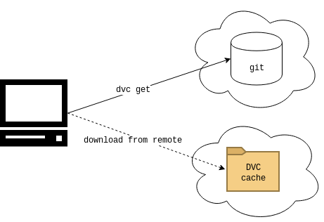

# DVC Dependency Management

This post is a follow up to [A walkthrough of DVC](https://blog.codecentric.de/en/2019/03/walkthrough-dvc/) and deals with managing dependencies between DVC projects.
In particular, this follow up is about importing specific versions of an artifact (e.g. a trained model) from one DVC project into another.

We discuss two _brand-new_[1](footnote1) DVC features, namely `dvc get` and `dvc import`.
- Intuitively, `dvc get` downloads an artifact from a DVC project (where DVC takes care of resolving the project's DVC cache and its remotes).
 E.g., `dvc get` is a very helpful tool in delivering your model to production in a CI/CD pipeline.
- Think of `dvc import` as `dvc get` plus managing version information for the downloaded artifact.
I.e., using `dvc import` you can manage artifacts from another DVC project like you would manage a software library dependency in a software engineering project.

You might want to browse through the walkthrough first, such that you can get the most out of this post.
For those of you in a hurry, we provide a quick [recap of the original walkthrough](#recap).
In the first part of this article we create a playground project which we use as a DVC dependency hands-on in the second part.
If you're in a hurry, still, note that part one can be skipped.
A publicly accessible playground project is provided, such that you can step right into the hands-on fun in part two.

A real world application of `dvc get` and `dvc import` will be discussed in an upcoming post. So stay tuned for more :-D

## Recap of the Original Walkthrough
In [A walkthrough of DVC](https://blog.codecentric.de/en/2019/03/walkthrough-dvc/) we trained a classifier for hand-written numbers.
The walkthrough showed how implementing a DVC-pipeline makes all of data loading, preprocessing, training, performance evaluation, etc. fully reproducible.
The gist is that DVC _versions_ training data, (hyper-)parameters, code and trained models _together_.
In particular, a DVC project resides in a Git repository, which implements all necessary versioning (see the following figure).
Binary data, such as e.g. training data and trained models, are located in DVC's so-called cache.
In particular, for each version of the pipeline, the cache contains different versions of all binary data.
However, cache data is _not_ stored in the Git repository itself, but in a separate so-called remote (e.g. an Amazon S3 bucket).
When checking out a specific version of the pipeline from the Git repository, DVC takes care of fetching cache data that matches the current pipeline version from the remote.

## Creating the Playground

As for the original walkthrough, [the GitHub repository](https://github.com/bbesser/dvc-deps-management) for the post you are reading now provides a readily usable working environment.
In this environment, you can interactively create the playground number classifier project (or let a script perform all actions for you).
Compared to the original walkthrough, the following extensions were implemented.
First, the playground project is pushed to GitHub such that it can easily be referenced as a DVC dependency.
Secondly, the playground's DVC cache is now pushed to a remote in an Amazon S3 bucket, such that binary data (e.g. trained models) can also be accessed from the internet.

To prepare the working environment (see the following code block), clone [the GitHub repository](https://github.com/bbesser/dvc-deps-management), change into the cloned directory, and start the working environment using `./start_environment.sh bash`.
You will be 'logged in' to a newly created container.
From the prompt in the container, configure variables at the top of the file `/home/dvc/scripts/walkthrough.sh` to match your GitHub repository and S3 bucket, where both must be empty and writable.
(Details of the bucket configuration are discussed in section [Configuring the S3 remote](#s3remote).)
Then, to automatically perform all steps from the extended walkthrough, you might want to execute `/home/dvc/scripts/walkthrough.sh`.
After the script is finished, the GitHub repository and the S3 bucket will now contain the playground DVC project and its cache data, respectively.

<pre>
# $ is the host prompt
# $$ is the working environment container prompt

$ git clone https://github.com/bbesser/dvc-deps-management
$ cd dvc-deps-management
$ vi scripts/walkthrough.sh # configure GitHub and S3 at the top
$ ./start_environment.sh bash # create and 'log in' to working environment
$$ /home/dvc/scripts/walkthrough.sh # creates the playground DVC project and its cache
</pre>

### Configuring the S3 Remote
In this section, we take a quick look at the part of the `scripts/walkthrough.sh` script that sets up an S3 bucket as the DVC-cache's remote.

In order to enable DVC to access a bucket, two preparations have to be done.
1. First, the `boto3` library must be installed, using `pip install boto3`. (This is already done in the working environment provided with this article.)
1. Secondly, `boto3` must be given access to the bucket.
Therefore, AWS credentials can be provided as environment variables like in the following code block.
(For the provided working environment, this configuration has to be done at the top of the `scripts/walkthrough.sh` script.)
<pre>
$$ export AWS_ACCESS_KEY_ID=...
$$ export AWS_SECRET_ACCESS_KEY=...
$$ # from here on, DVC can interact with your bucket 
</pre>
Other means of configuring S3 bucket access for DVC/`boto3` are [documented here](https://boto3.amazonaws.com/v1/documentation/api/latest/guide/configuration.html).

Adding an S3 bucket as a remote to a DVC project is the same as adding any other type of remote (see the following code block or `scripts/walkthrough.sh`).
Since the given URI start with `s3://`, DVC knows that the remote should reside in a bucket.
The `-d` flag tells DVC that this remote should be used by default.
Once the bucket is added, the DVC pipeline's configuration in `.dvc/config` should be saved, by committing the changes to Git.

<pre>
$$ dvc remote add -d playground_remote s3://YOUR_BUCKET_NAME
$$ git add .dvc/config # save the configuration of the newly added remote
</pre>

## Using a DVC Project as a Dependency
We discuss how to access an artifact of a DVC project.
To be more precise, we want to access an _output_ of the DVC project's pipeline.
An output is some (possibly binary) file created by the pipeline defined in the project.
To be precise, an output file is created by some stage of the pipeline, e.g. the training stage creates a trained model as output.
Recall that the pipeline and its output files are versioned.
Consequently, any version of any output file can be accessed.

We present two ways to access an output, namely `dvc get` and `dvc import`.
Intuitively, `dvc get` simply downloads an output file.
`dvc import` downloads an output file and additionally considers what version was fetched.

### Setup
The working environment given in section [Creating the playground](#createplayground) should also be used to follow along interactively with the commands presented in this section.
If you did not create your own playground project, when setting up the environment, you can ignore all steps regarding `scripts/walkthrough.sh`.

All commands discussed from here on are also available in `/home/dvc/scripts/deps_management.sh` in the working environment.

To enable DVC to access the playground project, recall that DVC needs to know its GitHub repository's URL.
Also, cache data is located in an S3 bucket remote and read access to that bucket must be provided.
Configure your environment as follows:
<pre>
$$ export GIT_REPO=<your_playground_repo_url>
$$ export AWS_ACCESS_KEY_ID=<your_playground_key>
$$ export AWS_SECRET_ACCESS_KEY=<your_playground_secret>
</pre>
If you did not create your own playground project, you can use [this publicly available playground project](https://github.com/bbesser/dvc-deps-management-playground).
Its URL and credentials are readily configured in `/home/dvc/scripts/deps_management.sh`.
(Note that the given AWS credentials provide no permissions except read access to the S3 bucket.)

### dvc get

When getting an output from a DVC project, DVC takes care of 'downloading' the desired version from the file.
In the following example, we download version 0.3 of the trained model from the playground project.

<pre>
$$ # replace with your playground GitHub repo (if any)
$$ GIT_REPO=https://github.com/bbesser/dvc-deps-management-playground.git

$$ dvc get --rev 0.1 $GIT_REPO model/model.h5
$$ ls
model.h5 # no other file was downloaded
</pre>

In particular, observe that no file was downloaded besides `model.h5`.
Consequently, there is no way for DVC to tell which version of `model.h5` is in your file system.
Hence, issuing the same `dvc get` command again, `model.h5` will be downloaded _again_.

Recall that the file `model.h5` is not part of the Git repository of the DVC project.
To download the file, DVC transparently resolves the cache remote of your project, see the following figure.
In our example, DVC inspects the following files in the tag 0.3 of `$GIT_REPO`:

<pre>
# file .dvc/cache
['remote "playground_remote"']
url = s3://dvc-deps-management.bertatcodecentric.de/dvc-cache
[core]
remote = playground_remote

# file train.dvc
# [...]
outs:
- md5: 1042d7fd78dd740019699eaaefd1822f
  path: model/model.h5
  cache: true
  metric: false
  persist: false
</pre> 

From there, DVC deducts that `model.h5` is a file with md5 sum `1042d7fd78dd740019699eaaefd1822f` in the given remote S3 bucket.

### dvc import

`dvc import` adds version control to `dvc get`, i.e., `dvc import` is meant to manage a software project's dependencies to DVC outputs.
The project that receives an import must itself be a DVC project (although it does not have to be an ML project).
This way, DVC is able to track the desired version of the imported data as the software project evolves over time.

Here is an example of creating a new project that imports another DVC project's output, namely `model.h5`.
<pre>
$$ git init
$$ dvc init
$$ git add .
$$ git commit -m 'initialize repository'
$$ dvc import --rev 0.1 $GIT_REPO model/model.h5

$$ # besides downloading the output,
$$ # dvc also stores some versioning information ...
$$ ls
model.h5  model.h5.dvc

$$ # ... which contains the 'source' of the output
$$ cat model.h5.dvc
[...]
deps:
- repo:
    url: https://github.com/bbesser/dvc-deps-management-playground.git
    [...]
    rev: '0.1'
  path: model/model.h5
[...]
</pre>

Observe that, following the DVC approach, the imported binary file `model.h5` will not be committed to the Git repository.
Instead, the import is managed by committing the DVC file `model.h5.dvc` to our project.
Following the naming convention that `.dvc` files represent _stages_ of a pipeline, a `.dvc` file for an import is called an _import stage_.

<pre>
$$ git status # model.h5 is not listed as untracked ...
    .gitignore
    model.h5.dvc
$$ cat .gitignore # ... since it's ignored
/model.h5
$$ git add model.h5.dvc .gitignore
$$ git commit -m 'import model.h5 (version 0.1)'
$$ git tag v0.0.1
</pre>

As time goes by and your project evolves, a new version of the import becomes available.
Updating to the new version is easy:

<pre>
$$ dvc import --rev 0.2 $GIT_REPO model/model.h5 # bump revision to 0.2
$$ # the file model.h5 now contains the newer version of the model
$$ git status
    modified:   model.h5.dvc
$$ git add model.h5.dvc
$$ git commit -m 'update model.h5 to version 0.2'
$$ git tag v0.0.2 # version 0.0.2 of our project uses version 0.2 of model.h5
</pre>

#### Cloning a Project with DVC Dependencies

In the project created in the previous section, the Git repository does not contain the binary file `model.h5`.
So, if one of your team members clones this project, she will not receive `model.h5`.

<pre>
$$ # checkout tag v0.0.1 of the software project
$$ ls
model.h5.dvc # the model is not part of the git repository
</pre>

How does she obtain `model.h5` without reproducing the entire pipeline?
Meet `dvc update`, which takes care of updating an import stage to the version given in its `.dvc` file.

<pre>
$$ dvc update model.h5.dvc
$$ ls
model.h5  model.h5.dvc # dvc update downloaded version 0.1 of model.h5
</pre>

When issuing the same command again, DVC detects that the version of `model.h5` did not change, and therefore does not download the output again.

<pre>
$$ dvc update model.h5.dvc
Stage 'model.h5.dvc' didn't change.
Output 'model.h5' didn't change. Skipping saving.
[...]
</pre>

However, when updating the import for another version, DVC detects that another binary must be fetched.

<pre>
$$ git checkout v0.0.2
$$ dvc update model.h5.dvc
WARNING: Output 'model.h5' of 'model.h5.dvc' changed because it is 'not in cache'
WARNING: Stage 'model.h5.dvc' changed.
Reproducing 'model.h5.dvc'
Importing 'model/model.h5 (https://github.com/bbesser/dvc-deps-management-playground.git)' -> 'model.h5'
Preparing to download data from 's3://dvc-deps-management.bertatcodecentric.de/dvc-cache'
[...]
</pre>

# Wrap-up
We introduced you to the DVC commands `get`, `import`, and `update` which allow you manage artifacts from a DVC project as dependencies.
While `get` simply downloads an artifact, `import` and `update` enable you to track the version of the artifact in your software project.

In an upcoming post, we demo these features in a real world application.
We're happy to meet you there :-D

# Notes

1 If `dvc get` and `dvc import` are not available in your DVC version, you can try a recent development version of DVC like so:
<pre>
# create sandbox for recent DVC version
pip install virtualenv # if not already installed
cd /tmp
virtualenv sandbox

# open sandbox and install recent DVC version into it
source sandbox/bin/activate
pip install git+git://github.com/iterative/dvc@0.52.1
</pre>

# TODO
- / clarify usages of terms `cache` and `remote`
- / use _import stage_ where appropriate
- / rename companion project to playground
- / rename cache remote to playground
- / clarify usage of terms output and artifact
- / clarify usage of terms import and dependeny`
